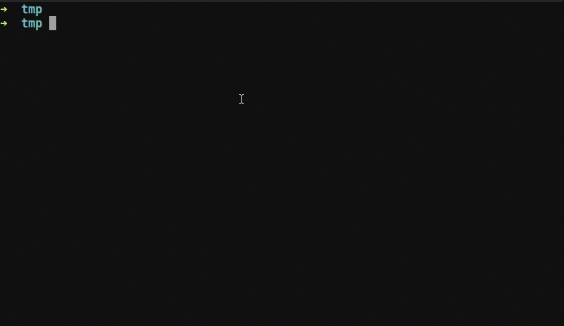

# vimgdb
Vim plugin implement GDB front-end for c/c++ gdb base on Neovim + Tmux:
  - Re-implement plugin [neogdb.vim](https://github.com/huawenyu/neogdb.vim) by python,
  - Windows layout manage by Tmux
  - Ref: https://github.com/sakhnik/nvim-gdb/

## Feature
  - gdb commands maps: next, step, finish, continue, etc.
  - breakpoints:
    + auto save/load,
    + populate to local list: lopen
    + side color sign
    + triple state: enable -> disable -> delete
    + toggle current line/toggle-all-breakpoints
    + support condition set
  - backtrace:
    + populate to quickfix: copen


## PreRequire [must]
  - neovim +python3
  - tmux
  - python3 library:
    + sudo pip3 install pynvim
    + sudo pip3 install libtmux
  - Install This vim plugin [vimgdb](https://github.com/huawenyu/vimgdb)
    + If using vim-plugin-manage like: [vim-plug](https://github.com/junegunn/vim-plug)
      - add to `.vimrc`
        Plug 'huawenyu/vimgdb'
      - install the plug
        Execute vim's command: ":PlugInstall"

        Plug 'huawenyu/new.vim', Cond(has('nvim')) | Plug 'huawenyu/new-gdb.vim', Cond(has('nvim'))
    ### And install the plug
        vi's command: ":PlugInstall"
  - Press <F2> to toggle local or remote(need script support login to remote host and start gdbserver listen on port).
  - Debug:
    Focus the source code t1.c windows, and Press:
      F5   next
      S-F5 skip
      F6   step
      S-F6 return to caller
      F8   eval current value
    <end>

## QuickStart

1. Open terminal like xterm, gnu-terminal
2. start tmux:
	$ tmux new -s test
3. edit a *.c file by neovim:
	$ nvim t1.c
	$ gcc -g -O0 -o t1 t1.c
4. Press <F2>, or execute command
	:call VimGdb('local', 't1')
5. The gdb frontend start:
	- will close current tmux-window's other panes execept the nvim pane
	- recreate another new pane for gdb-shell
	- auto set breakpoint at main() if no breakpoint
	- run and pause at main, or at your breakpoint

# Command & Keymap

## commands
  - :GdbLocal
  - :GdbDebugStop
  - :GdbToggleBreakpoint
  - :GdbClearBreakpoints
  - :GdbContinue
  - :GdbNext
  - :GdbStep
  - :GdbFinish
  - :GdbFrameUp
  - :GdbFrameDown
  - :GdbInterrupt
  - :GdbEvalWord
  - :GdbWatchWord

## Default keymaps
  - `<F2>`       start Helper
  - `<F3>`       refresh and re-locate current line
  - `<F4>`       continue
  - `<Shift+F4>` stop
  - `<F5>`       next
  - `<Shift+F5>` just skip one line and not execute it
  - `<F6>`       step
  - `<Shift+F6>` finish current function and return to the caller
  - `<F7>`       continue execute util this line
  - `<F8>`       eval current member or eval the selected expression
  - `<Shift+F8>` watch current member or watch the selected expression
  - `<F9>`       toggle the current breakpoint
  - `<F10>`      toggle all breakpoints

## Customization

Put these in your ``~/.vimrc`` to customize the keymaps:

### keymaps leader

If define *g:neobugger_leader*, will *ignore* all *g:gdb_keymap_...* customized.

```vim
let g:neobugger_leader = ';'
```

Then the keymaps will be `g:neobugger_leader` + `<char>`, the `<char>` like:
  - `r`: GdbRefresh
  - `c`: GdbContinue
  - `n`: GdbNext
  - `i`: GdbStep
  - `N`: GdbFinish
  - `t`: GdbUntil
  - `b`: GdbToggleBreak
  - `a`: GdbToggleBreakAll
  - `C`: GdbClearBreak
  - `x`: GdbDebugStop
  - `k`: GdbFrameUp
  - `j`: GdbFrameDown

### keymaps without leader

| Mapping          | Command                              | Description                                                          |
|------------------|--------------------------------------|----------------------------------------------------------------------|
| &lt;F4&gt;       | `:GdbContinue`                       | Continue execution (`continue` in gdb)                               |
| &lt;F5&gt;       | `:GdbNext`                           | Step over the next statement (`next` in gdb)                         |
| &lt;F6&gt;       | `:GdbStep`                           | Step into the next statement (`step` in gdb)                         |
| &lt;F7&gt;       | `:GdbFinish`                         | Step out the current frame (`finish` in gdb)                         |
| &lt;F8&gt;       | `:GdbEval`                           | Eval current variable's value (`print var` in gdb)                   |
| &lt;F9&gt;       | `:GdbBreakpointToggle`               | Toggle breakpoint in the coursor line                                |
| &lt;c-p&gt;      | `:GdbFrameUp`                        | Navigate one frame up (`up` in gdb)                                  |
| &lt;c-n&gt;      | `:GdbFrameDown`                      | Navigate one frame down (`down` in gdb)                              |

```vim
" Howto map Shift+F#:
"   - Goto insert mode and hit Ctrl-V Shift-F#, which gotted we can use that to map.
"   - For example: We get "<F15>" when input Shift+F5, so ':nmap <F15> echo "HELLO"<cr>' should be work.
" The default config:
"
let g:gdb_keymap_refresh = '<f3>'

let g:gdb_keymap_continue = '<f4>'
let g:gdb_keymap_debug_stop = '<F14>'

let g:gdb_keymap_next = '<f5>'
let g:gdb_keymap_skip = '<F15>'

let g:gdb_keymap_step = '<f6>'
let g:gdb_keymap_finish = '<F16>'

let g:gdb_keymap_until = '<f7>'

let g:gdb_keymap_eval = '<f8>'
let g:gdb_keymap_watch = '<F18>'

let g:gdb_keymap_toggle_break = '<f9>'
let g:gdb_keymap_remove_break = '<F19>'

let g:gdb_keymap_toggle_break_all = '<f10>'
let g:gdb_keymap_clear_break = '<F20>'

let g:gdb_keymap_frame_up = '<c-n>'
let g:gdb_keymap_frame_down = '<c-p>'
let g:neogdb_gdbserver = 'gdbserver'
let g:neogdb_attach_remote_str = 't1 127.0.0.1:9999'
let g:gdb_auto_run = 1
let g:gdb_require_enter_after_toggling_breakpoint = 0
let g:restart_app_if_gdb_running = 1
let g:neobugger_smart_eval = 0
let g:neobugger_local_breakpoint = 0
let g:neobugger_local_backtrace = 0
let g:neobugger_server_breakpoint = 1
let g:neobugger_server_backtrace = 1
```

# Layout

```
+-------------------------+--------------------------+
|                         |                          |
|                         |                          |
|                         |                          |
|                         |    terminal>             |
|     Code c/c++          |    (gdb)                 |
|                         |                          |
|                         |                          |
|                         |                          |
|                         |                          |
|                         +--------------------------+
|                         |                          |
+-------------------------+  backtrace               |
| breakpoints             |                          |
|                         |                          |
+-------------------------+--------------------------+

```
## Screen Demo

[](#features)

# Const define

	check source code class Common(BaseCommon)

# Troubleshooting

## Enable log

1. change vimgdb/config/logger.py:
	LOGGING_CONFIG.loggers
        '': {
            'level':     'DEBUG',    <=== change log level
            'handlers':  ['file'],   <=== Enable log by 'file', Disable log by 'null'
            'propagate': False
        },

2. monitor the debug log:
	Monitor LOGGING_CONFIG.handlers.file.filename, here is '/tmp/vimgdb.log':
	$ tail -f /tmp/vimgdb.log

3. color the tail: "grc tail -f /tmp/vimgdb.log"

	[grc](https://github.com/garabik/grc)
	Install:
	$ brew install grc

	Usage:
	$ grc netstat
	$ grc ping hostname
	$ grc tail /var/log/syslog
	$ grc ps aux

